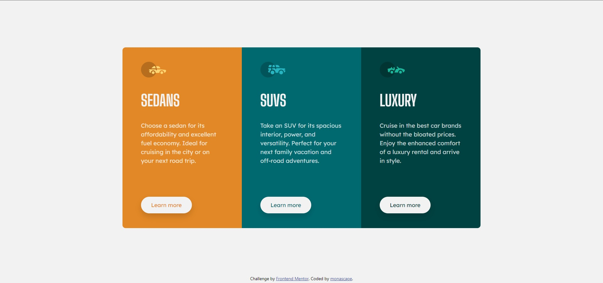

# Frontend Mentor - 3-column preview card component solution

This is a solution to the [3-column preview card component challenge on Frontend Mentor](https://www.frontendmentor.io/challenges/3column-preview-card-component-pH92eAR2-). Frontend Mentor challenges help you improve your coding skills by building realistic projects. 

## Table of contents

- [Frontend Mentor - 3-column preview card component solution](#frontend-mentor---3-column-preview-card-component-solution)
  - [Table of contents](#table-of-contents)
  - [Overview](#overview)
    - [The challenge](#the-challenge)
    - [Screenshot](#screenshot)
    - [Links](#links)
  - [My process](#my-process)
    - [Built with](#built-with)
    - [What I learned](#what-i-learned)
    - [Continued development](#continued-development)
  - [Author](#author)

## Overview

### The challenge

Users should be able to:

- View the optimal layout depending on their device's screen size
- See hover states for interactive elements

### Screenshot

### Links

- Solution URL: [Add solution URL here](https://github.com/monascape/column-of-3-frontend-mentor-challenge)
- Live Site URL: [Add live site URL here](https://monascape.github.io/column-of-3-frontend-mentor-challenge)

## My process

### Built with

- Semantic HTML5 markup
- CSS custom properties
- Flexbox
- [Bootstrap v5.1](https://getbootstrap.com/)

### What I learned

Improving the use of cols to make the columns and placing them in the middle of screen.

### Continued development

Take more advantage of bootstrap and other frameworks and learn to make a mobile first website.

## Author

- LinkedIn - [monascape](https://www.linkedin.com/in/monascape/)
- Frontend Mentor - [@monascape](https://www.frontendmentor.io/profile/monascape)
- Twitter - [@monascape](https://www.twitter.com/monascape)
